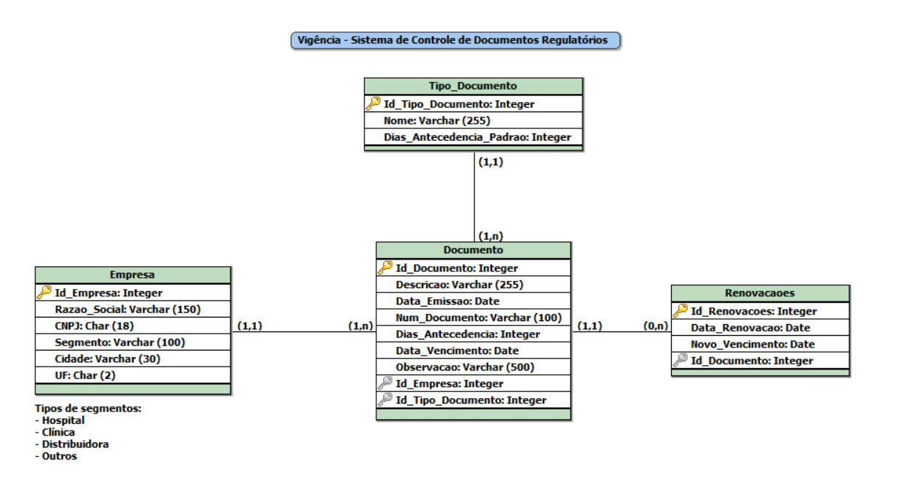

# Vigencia_Controle_Documentos
Sistema desktop desenvolvido em Java com Swing para controle de validade de documentos regulatórios de empresas na área da saúde.
Permite cadastrar empresas, tipos de documentos e acompanhar vencimentos com alertas automáticos.

## Funcionalidade
- Dashboard com cards de resumo e alertas de documentos vencidos ou próximos do vencimento
- Cadastro de empresas com validação matemática de CNPJ (verificação dos dígitos verificadores)
- Seleção de cidade/UF via dados oficiais do IBGE
- Cadastro de tipos de documento com prazo de antecedência padrão configurável
- Cadastro de documentos vinculados à empresa e tipo, com cálculo automático de status
- Renovação de documentos com histórico completo — documentos válidos não podem ser renovados
- Validação de campos obrigatórios e limite de caracteres em todos os formulários, conforme modelagem
- Persistência em JSON — dados salvos localmente sem banco de dados externo
- Código organizado em pacotes por responsabilidade e comentado

## Modelagem



O sistema foi modelado com 4 entidades principais:
- **Empresa** — dados cadastrais da organização de saúde
- **Tipo_Documento** — categorias de documentos com prazo de antecedência padrão
- **Documento** — documento vinculado a uma empresa e tipo, com datas e status automático
- **Renovacoes** — histórico de renovações de cada documento

## Telas do Sistema
```
Dashboard — Visão geral com alertas e cards de resumo;
Empresas — CRUD completo de empresas;
Tipos de Documento — CRUD completo de tipos;
Documentos — CRUD completo de documentos;
Renovação — Formulário de renovação com histórico;
```

## Estrutura do Projeto
```
src/
├── app/                  # Telas e formulários (Swing)
│   ├── TelaPrincipal.java
│   ├── PainelDashboard.java
│   ├── PainelEmpresas.java
│   ├── PainelDocumentos.java
│   ├── PainelTipos.java
│   ├── FormularioEmpresa.java
│   ├── FormularioDocumento.java
│   ├── FormularioRenovacao.java
│   └── FormularioTipo.java
├── modelos/              # Entidades do sistema
│   ├── Empresa.java
│   ├── Documento.java
│   ├── TipoDocumento.java
│   └── Renovacao.java
├── repositorio/          # Persistência em JSON
│   ├── EmpresaRepositorio.java
│   ├── DocumentoRepositorio.java
│   └── TipoDocumentoRepositorio.java
├── util/                 # Utilitários
│   ├── JsonUtil.java
│   ├── StatusUtil.java
│   └── LocalidadeUtil.java
├── icons/                # Ícones da interface
│   ├── CardAVencer.png
│   ├── CardDocumentos.png
│   ├── CardEmpresas.png
│   ├── CardVencidos.png
│   ├── LogoVigencia.png
│   ├── MenuDashboard.png
│   ├── MenuDocumento.png
│   ├── MenuEmpresa.png
│   └── MenuTiposDocumentos.png
├── dados/                # Dados do IBGE (estados e cidades)
│   ├── estados.json
│   └── municipios.json
└── Main.java
der_logico/               # Modelagem do banco de dados
└── DER_Logico.png
json/                     # Arquivos de persistência
├── empresas.json
├── documentos.json
└── tipos.json
README.md
```

## Requisitos
- JDK 25 — Eclipse Adoptium Temurin 25
- VS Code com a extensão Extension Pack for Java

## Como Executar
1. Clone o repositório
2. Compile os arquivos em `src/` para `bin/`
3. Copie os ícones: `xcopy src\icons bin\icons /E /I /Y`
4. Execute: `java -cp bin Main`

## Persistência
Os dados são salvos automaticamente em arquivos JSON na pasta `json/` a cada operação. Não é necessário banco de dados.

## Autoria
Desenvolvido por **Camila Dias Gomes** como projeto final da disciplina de Programação Desktop — 3º Semestre de Sistemas para Internet, IFMT.